# MY COFFEE SHOP 

## [LIVE DEMO](https://rusdiana97.github.io/coffee-shop.github.io/)

###### ***WORK IN PROGRESS...***

### Description

I am a big coffee lover. This is where the idea of making a project about a coffee shop started. In addition, I wanted to create a much more complex project compared to previous projects in which to test my frontend knowledge.

### Technologies

For this project I used: 
1. HTML
2. CSS
3. Bootstrap
4. JavaScript
5. Visual Studio Code for writing code
6. Firefox for testing/debbuging
7. Others (free sites for images, icons, videos)

### User stories

1. As a site visitor, I want a home page where I can see stuffs about coffee.
2. As a site visitor, I want to see which are the most popular coffees on MY COFFEE SHOP website and see details about them for purchased them.
3. As a site visitor, I want to buy coffee packages.
4. As a site visitor, I want to see an about page.
5. As a site visitor, I want to be able to subscribe to the website.
6. As a site visitor, I want a contact page where I can message the customer for more details about their coffee.
7. As a user, I want a login page.
8. As a site visitor, I want an authentification page.
9. As a site visitor, a user, I want to see my shopping cart.

### How to use it

You can view de project and navigate on the website:
1. click on LIVE DEMO (the project will show on your browser)
2. download the project from my GITHUB account (click on index.html page for showing the project on your browser)

### Preview

Here is the main page for MY COFFEE SHOP:

Click on the WHAT'S TRENDING NOW button to see the popular coffee packages on this site:

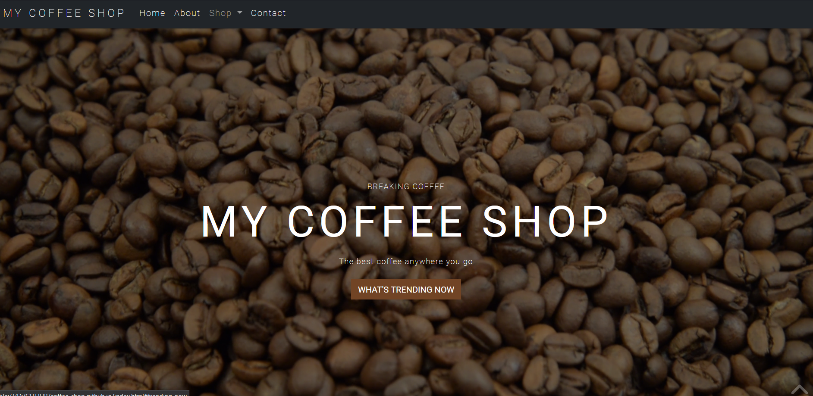

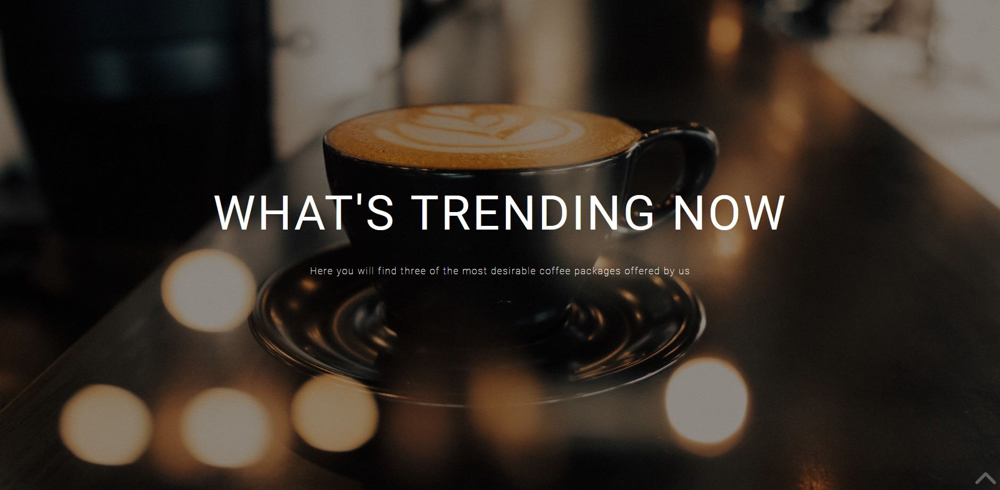

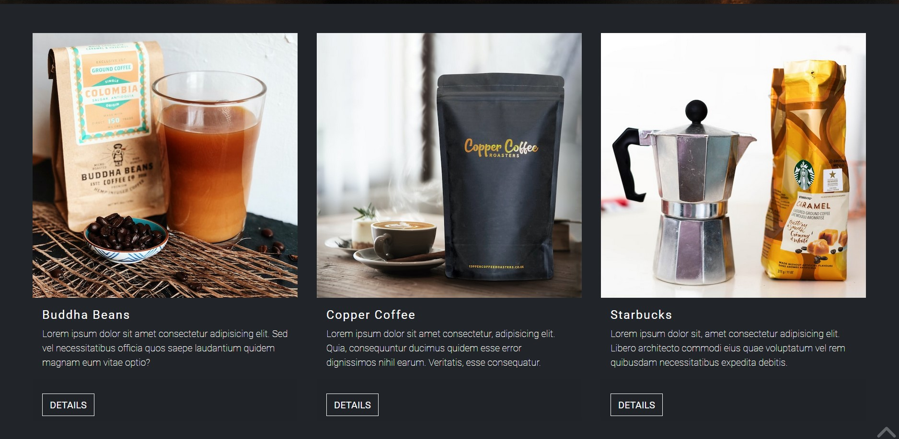

See details (press DETAILS button) about the popular coffees on this site:

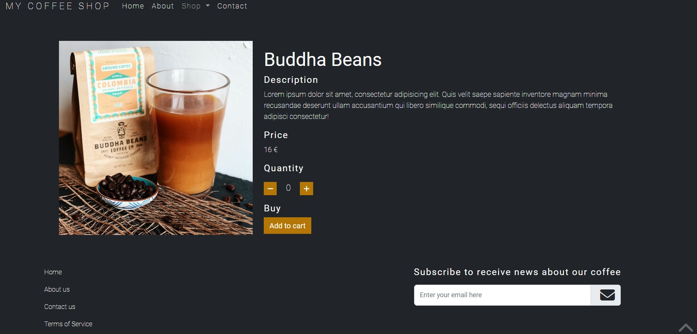

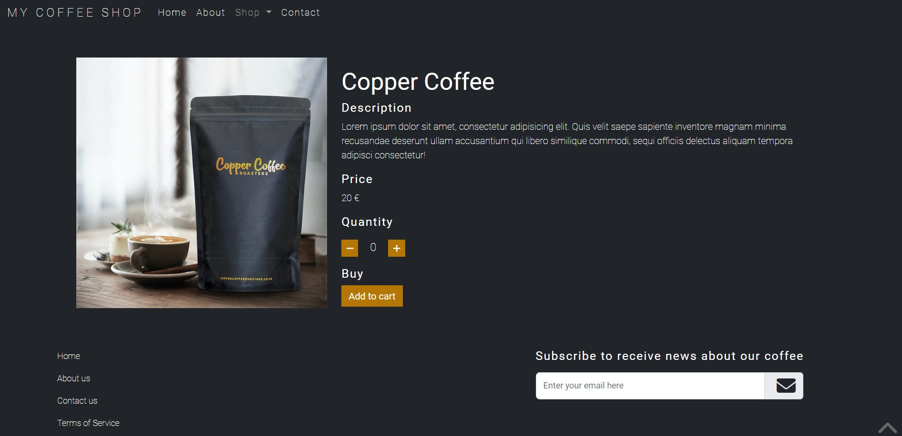

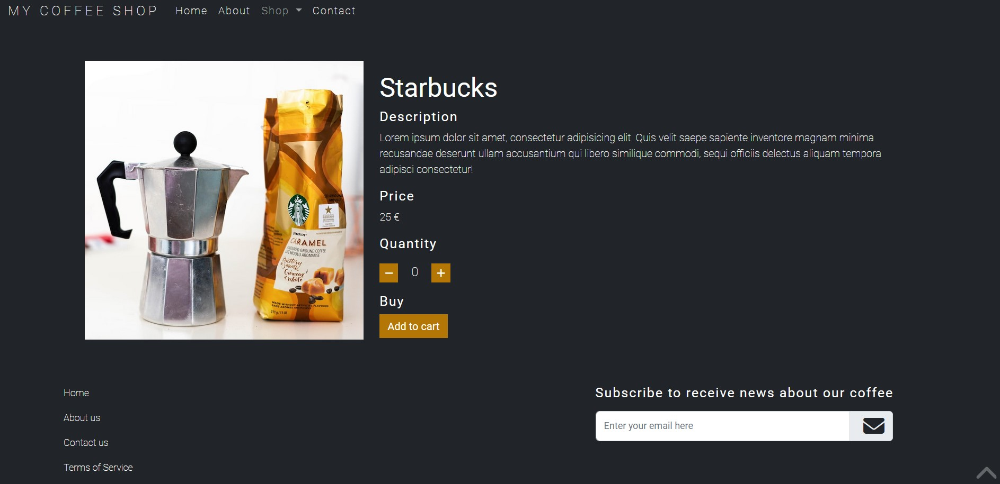

You can select the quantity for the coffee package and add it to your shopping cart (not implement yet).

Based on the menu you can visit the:
1. About page:

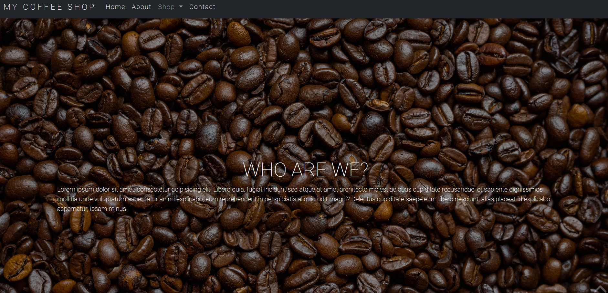

2. Shop page with two others sub-pages: Coffee, Merch (not implement yet):

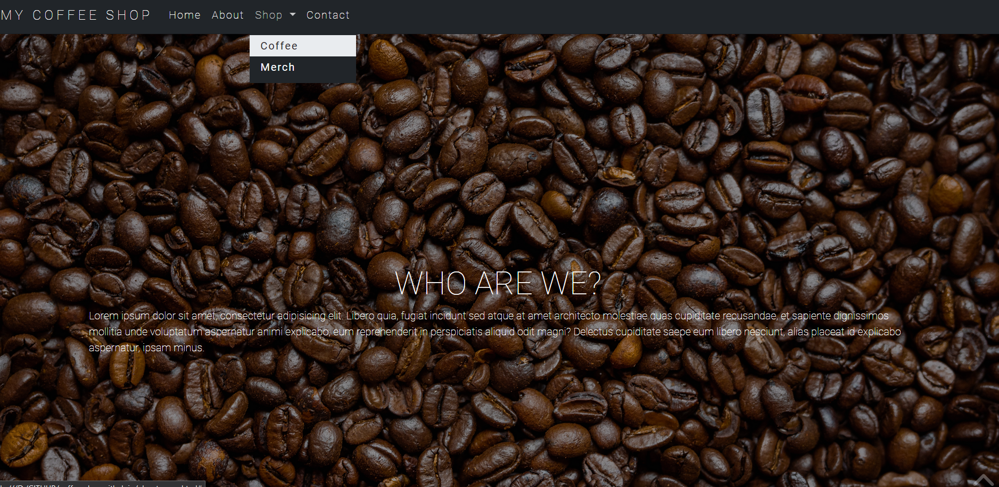

3. Contact page:

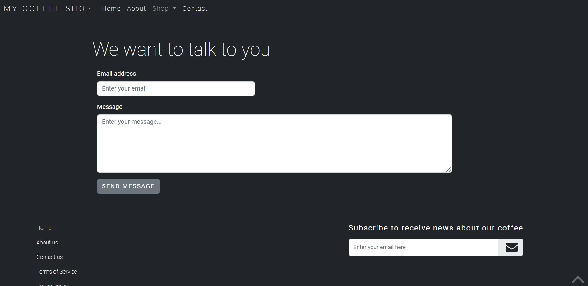

4. Home page (you cand go back to it):

Keep scrolling on the page to see more stuffs about coffee

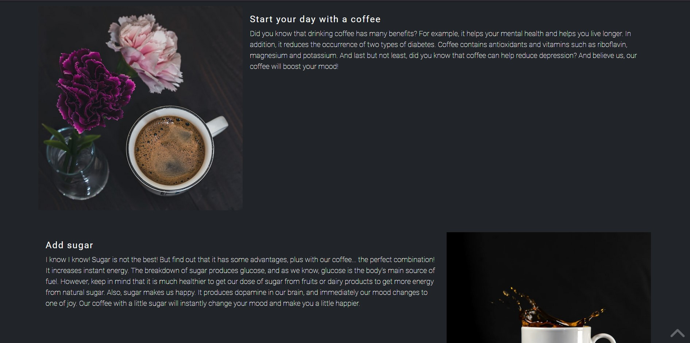

Here is the footer of the page with some links to another pages, links to socials media, and for subscribing.

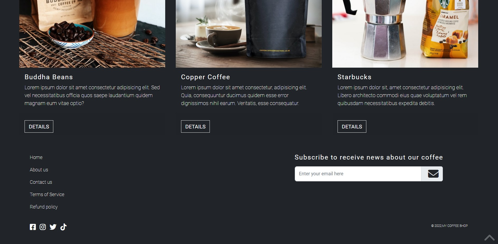

You can go up to the page by pressing the arrow icon from the bottom-right.
